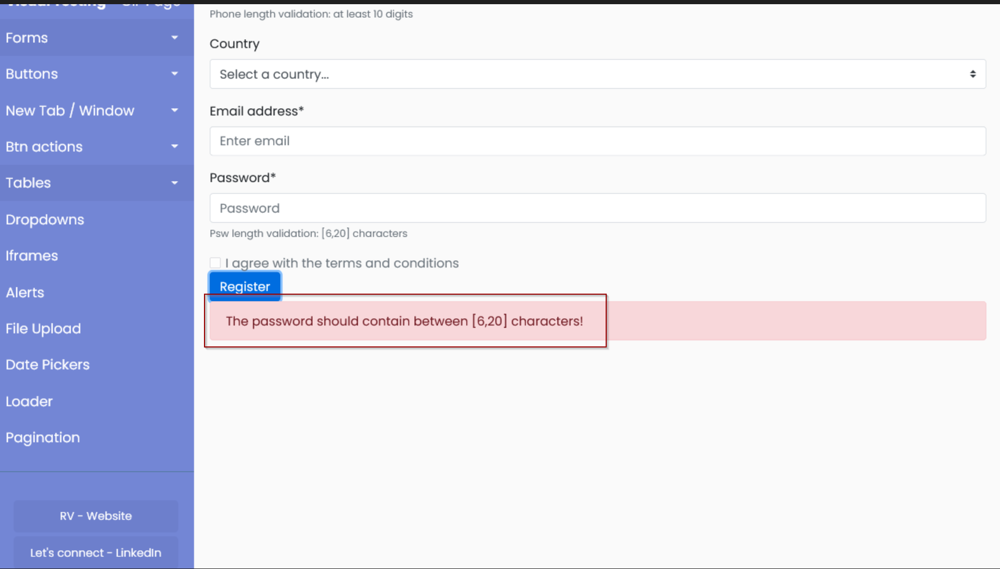
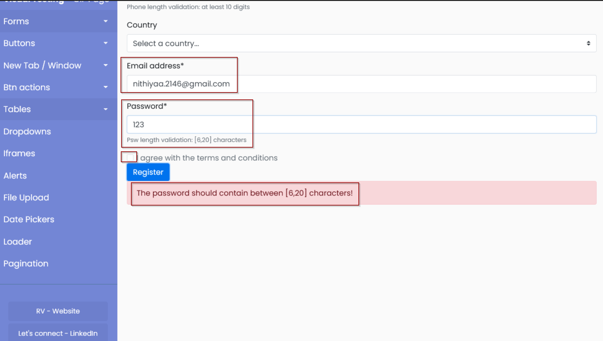
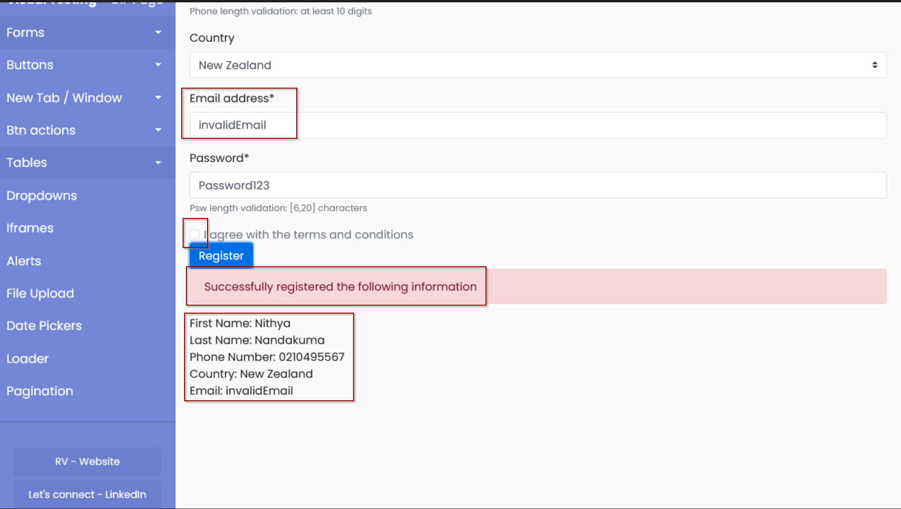
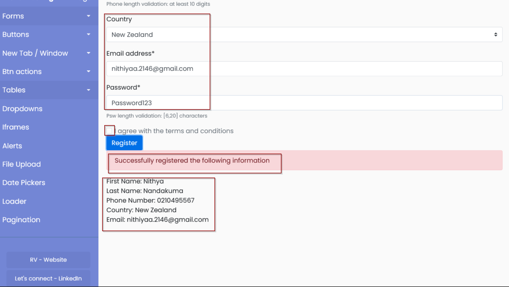
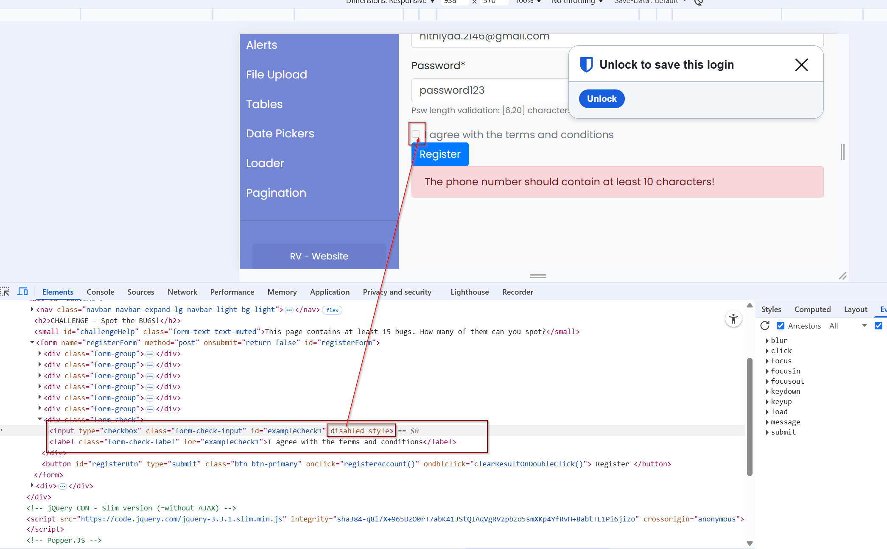
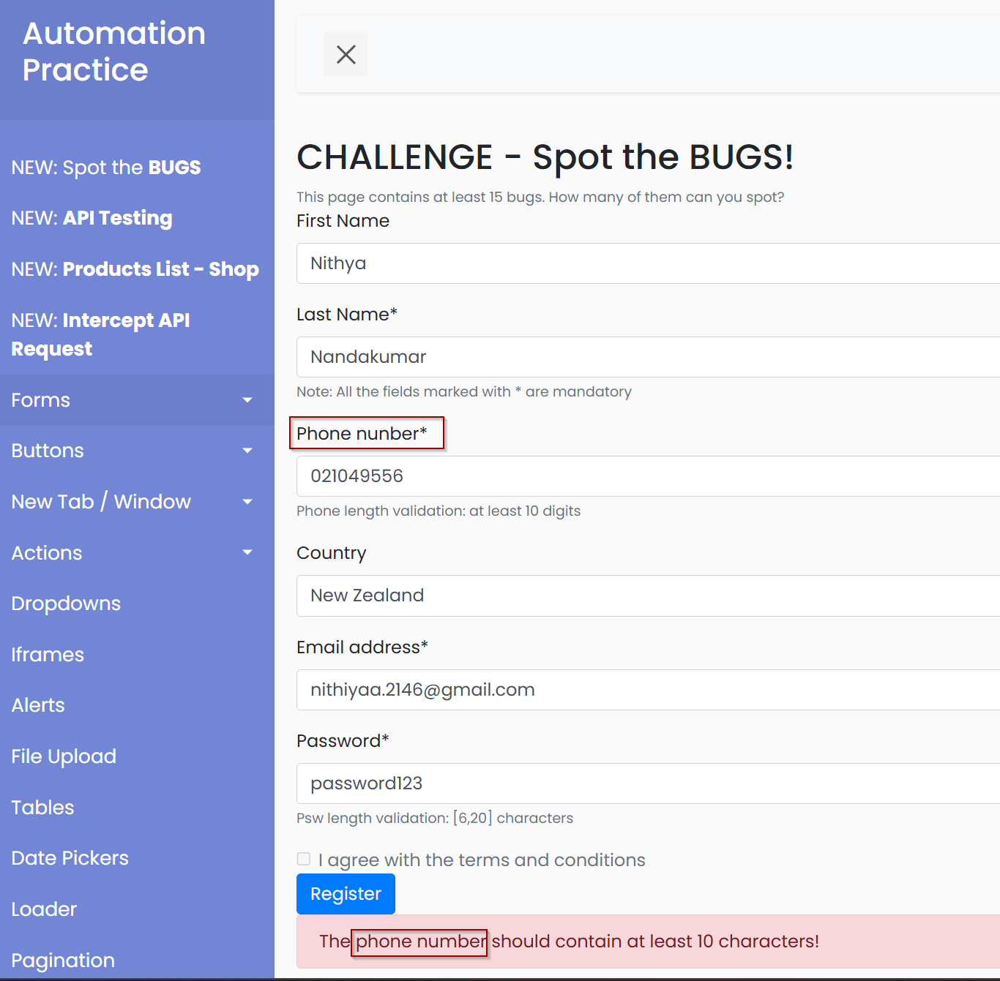
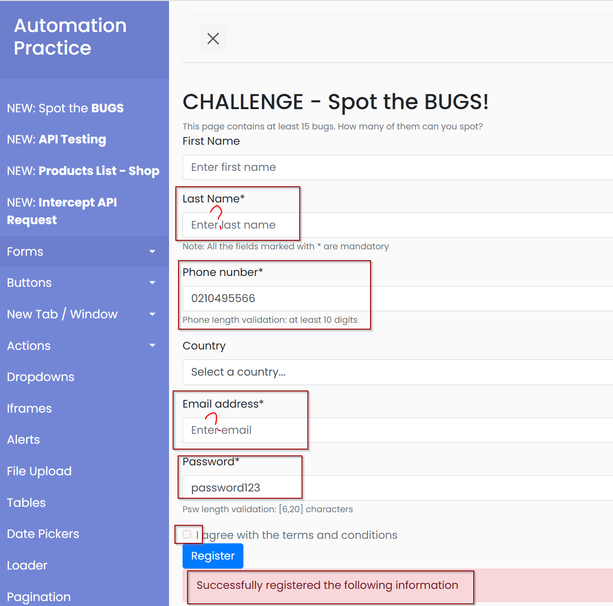
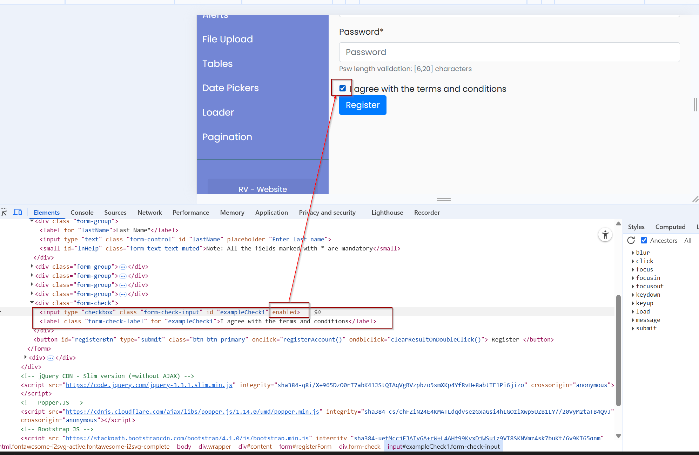
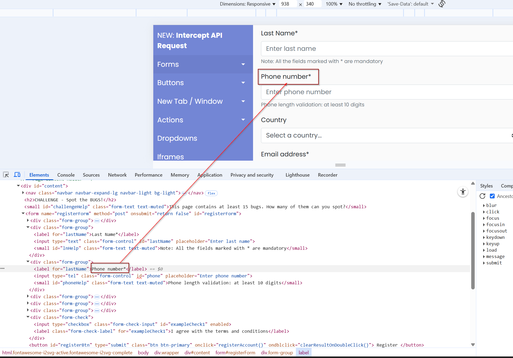

# Bug Form Automation - QA Practice

## 1.Project Overview
- This project is a **technical assessment** to demonstrate automated testing skills using **Playwright**.  
- The focus is on identifying bugs and validating form functionality as an end user would experience it.  
- The tests are designed to be readable, maintainable, and include automated screenshots and logs for reporting.

**Test Page:** [QA Practice - Bug Form](https://qa-practice.netlify.app/bugs-form)
---
## 2.Objective
- Write automated tests to find bugs in the form.
- Validate that the page functions as an end user expects.
- Capture screenshots and logs to support findings.
- Demonstrate understanding of Playwright and testing best practices.
---
## 3.Tools & Framework
- **Automation Framework:** Playwright (JavaScript)
- **Test Runner:** Playwright Test
- **Reporter:** HTML Reporter
- **Data Management:** JSON (`test-data.json`)
- **Browser Coverage:** Chromium, Firefox, Webkit
---
## 4.Project Structure
project-root/
│
├─ tests/ # Contains all test scripts
│ └─ bug-form.spec.js 
├─ screenshots/ # Captured screenshots (success & failure)
├─ test-data.json # User data for tests
├─ playwright.config.js 
└─ README.md
---
## 5.Setup Instructions
1. Clone the repository:  
2. Install project dependencies: npm install
3. Install Playwright browsers: npm init playwright@latest
---
## 6.Run tests
- npx playwright test --headed 
---
## 7.View HTML report
- npx playwright show-report
---
## 8. Test Approach
 - Data is stored in **test-data.json** for reuse and easy modification:
 {
  "validUser": {
    "firstName": "Nithya",
    "lastName": "Nandakumar",
    "phone": "0210495566",
    "country": "New Zealand",
    "email": "nithiyaa.2146@gmail.com",
    "password": "Password123"
  }
}
--- 
## 9.Test Strategy
 1. **Negative Tests / Validation Checks**
    - Empty fields submission
    - Invalid email with short password
    - Invalid email with valid password (demo bug: registration allowed)

 2. **Positive Test**
    - Fill all fields with valid data
    - Ensure successful registration

 3. **Non-Automatable Observations**
    - Checkbox disabled: cannot be programmatically clicked
---
## 10.Test Performed
 1. **Empty Form Submission**
    - **Description:** Opened the form and clicked "Register" without filling any fields.
    - **Expected Result:** Validation message should appear for required fields.
    - **Actual Result:** Error shown: `The password should contain between 6 to 20 characters!`
    - **Screenshot:** 
    - **Notes:** Demonstrates the form prevents empty submissions.

 2. **valid Email & Short Password**
    - **Description:** Filled all fields with valid email and password with **5 characters.**
    - **Expected Result:** Error message for password length and invalid email.
    - **Actual Result:** Error shown: `The password should contain between 6 to 20 characters!`
    - **Screenshot:** 
    - **Notes:** Confirms that password length is validated even when email is incorrect.

 3. **Invalid Email & valid Password**
    - **Description:** Filled all fields, entered invalid email, password with 7+ characters.
    - **Expected Result:** Error message for invalid email.
    - **Actual Result:** Form allowed submission -`Successfully registered the following information.`
    - **Screenshot:** 
    - **Notes:** Demonstrates that email validation is not fully enforced on this demo page.

4. **Successful Registration**
  - **Description:** Filled all required fields with valid data (using JSON file for test data).
  - **Expected Result:** Form submits successfully.
  - **Actual Result:** Form registered successfully - `Successfully registered the following information.`
  - **Screenshot:** 
  - **Notes:** Captured console logs and screenshots for confirmation.
  
5. **Valid Email & Short Phone Number**
  - **Description:** Entered valid email and other details, but phone number less than 10 digits.
  - **Expected Result:** Error message requesting at least 10-digit phone number.
  - **Actual Result:** Validation message appeared: `Phone length validation: at least 10 digits`
  - **Screenshot:** `screenshots/short-phone.png`
  - **Notes:** Confirms phone number length validation is working.
  
6. **Manual Validation Checks (Not Automated)**
  - These tests were **manually validated** due to time constraints (`4 hours allocated`). Screenshots were captured for reference.

  **Checkbox "I agree with the terms and conditions"**  
  - Observation: Disabled  
  - Notes: Inspected via browser DevTools. Confirmed cannot be clicked.  
  - Screenshot: 

  **Phone Number Field Label**  
  - Observation: Typo – "Phone nunber" instead of "Phone number"  
  - Notes: Observed directly on the form.  
  - Screenshot: 

  **Mandatory Field Validation**  
  - Observation: Fields marked with * (Last Name, Phone Number, Email, Password)  
  - Notes: Only **Password** and **Phone Number** are enforced. Leaving Last Name and Email empty still allows registration.  
  - Screenshot: 
---
## 11.Solution / Fixes (Manual Validation via DevTools)

   1. **Checkbox “I agree with the terms and conditions”**
      - Issue: Disabled and could not be clicked.
      - Manual Fix: Used browser DevTools to remove the disabled attribute and then clicked the checkbox.
      - Observation: After editing in DevTools, the checkbox was selectable and the form accepted the selection.
      - Screenshot:

   2. **Phone Number Field Label**
      - Issue: Typo in label – `Phone nunber` instead of `Phone number.`
      - Manual Fix: Edited the label text in DevTools to the correct spelling.
      - Observation: The corrected label appeared on the form page as expected.
      - Screenshot: 

    **Notes:**
    - These fixes were applied temporarily in the browser using `DevTools` for **demonstration purposes.**
    - This shows understanding of the **underlying issues and how they can be resolved.**
    - Permanent fixes would require changes in the **actual codebase.**
---
## 12. Notes & Observations
  - Demo page allows registration even with invalid email (`bug observed`).  
  - Checkbox cannot be interacted with due to `disabled` attribute.  
  - Screenshots are captured for both `successful and failed` scenarios to document each test.  
  - Manual fixes via DevTools demonstrate the `underlying issues and potential solutions`.  
---
## 13. Next Steps / Recommendations
  - **Expand automated test coverage with additional negative and edge cases:**
      - Short phone number
      - Missing country selection
      - Password length validation
      - Mandatory field enforcement (Last Name and Email)
---
## 14. Author
  - **Name:** Nithya Nandakumar  
  - **Email:** nithiyaa.2146@gmail.com  
  - **Portfolio / Linkedin:** www.linkedin.com/in/nithya-nandakumar-787502253
